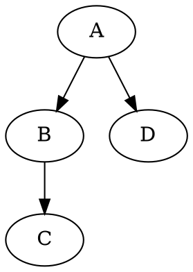
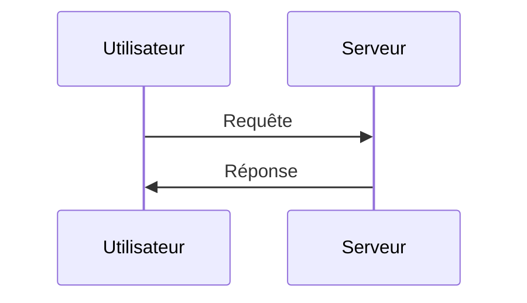

# APLFReactV2
## Guide d'Utilisation

Ce guide a pour objectif d'aider l'utilisateur à prendre en main l'application et à comprendre l'ensemble de ses fonctionnalités.

### Sommaire

- 1️⃣ Authentification
- 2️⃣ Navigation Principale
- 3️⃣ Réglages et Préférences
- 4️⃣ Gestion des Commerces et Boutons Raccourcis
- 5️⃣ Gestion des Dépenses Fixes et des Revenus

---

### 1️⃣ Authentification

**Première utilisation :**  
À la première utilisation, l'utilisateur accède à la page de connexion. Une page distincte est également disponible pour l'inscription.


Une fois inscrit, l'utilisateur peut se connecter et accéder à son tableau de bord.


---

### 2️⃣ Navigation Principale

L'utilisateur peut, via le menu de navigation, accéder à son profil ainsi qu'à ses paramètres.


---

### 3️⃣ Réglages et Préférences

**Accès aux réglages :**  
À partir du menu déroulant, l'utilisateur peut accéder à l'outil « Réglages », qui lui permet de modifier ses informations personnelles et ses préférences.

**Modification des informations :**  
L'utilisateur peut ainsi mettre à jour ses données personnelles.


---

### 4️⃣ Gestion des Commerces et Boutons Raccourcis

L'utilisateur a la possibilité d'ajouter ou de supprimer un commerce. De plus, il peut choisir d'afficher ou de masquer certains boutons raccourcis (par exemple, le bouton « Période Flottante » et le bouton « Templates »).


Sur la même page, un système d'historique enregistre l'intégralité des actions de l'utilisateur.


---

### 5️⃣ Gestion des Dépenses Fixes et des Revenus

L'utilisateur peut gérer ses dépenses fixes et ses revenus de manière efficace.

Les cartes de gestion permettent de :
- Utiliser un template,
- Ajouter une transaction,
- Effacer toutes les transactions,
- Afficher des graphiques.

Chaque transaction peut être supprimée ou modifiée individuellement.


Pour les transactions occasionnelles, un outil « Détail » est disponible, permettant d'analyser en profondeur chaque sous-transaction.


**Détails complémentaires :**


# Titre 1
## Titre 2
### Titre 3
#### Titre 4
##### Titre 5
###### Titre 6

## 2️⃣ Texte

**Gras**

*Italique*

~~Barré~~

**_Gras et Italique_**

> Bloc de citation

---

## 3️⃣ Listes

### Liste non ordonnée :
- Élément 1
- Élément 2
    - Sous-élément 2.1
    - Sous-élément 2.2

### Liste ordonnée :
1. Premier
2. Deuxième
3. Troisième

## 4️⃣ Liens et Images

[Texte du lien](https://example.com)


## 5️⃣ Tableaux

| Colonne 1 | Colonne 2 | Colonne 3 |
|-----------|-----------|-----------|
| Valeur 1  | Valeur 2  | Valeur 3  |
| Valeur A  | Valeur B  | Valeur C  |

## 6️⃣ Code

### Inline Code
Voici un exemple de `code inline`.

### Bloc de code
```javascript
function hello() {
    console.log("Hello, World!");
}
```

## 7️⃣ Tâches

- [x] Tâche terminée
- [ ] Tâche en attente

## 8️⃣ Emojis

🚀 🔥 🎯 ✅

## 9️⃣ Mathématiques (LaTeX)

$$E = mc^2$$

\( a^2 + b^2 = c^2 \)

## 🔟 Diagrammes

### Graphviz


### MermaidJS


## 🔹 HTML en Markdown

<p style="color: red; font-weight: bold;">Texte rouge en HTML</p>

## 🔸 Mentions et Références

@utilisateur pour mentionner quelqu'un.

## 🏁 Conclusion

Voici un modèle Markdown ultra complet pour tout type de document. 🚀
