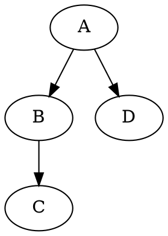
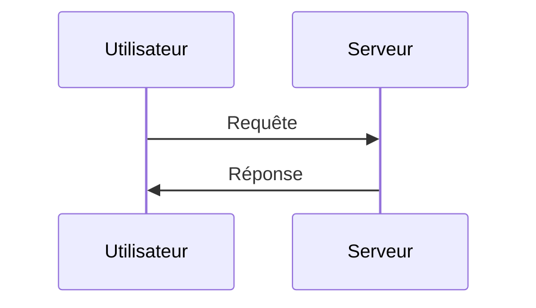

# Titre 1
## Titre 2
### Titre 3
#### Titre 4
##### Titre 5
###### Titre 6

## 2️⃣ Texte

**Gras**

*Italique*

~~Barré~~

**_Gras et Italique_**

> Bloc de citation

---

## 3️⃣ Listes

### Liste non ordonnée :
- Élément 1
- Élément 2
    - Sous-élément 2.1
    - Sous-élément 2.2

### Liste ordonnée :
1. Premier
2. Deuxième
3. Troisième

## 4️⃣ Liens et Images

[Texte du lien](https://example.com)


## 5️⃣ Tableaux

| Colonne 1 | Colonne 2 | Colonne 3 |
|-----------|-----------|-----------|
| Valeur 1  | Valeur 2  | Valeur 3  |
| Valeur A  | Valeur B  | Valeur C  |

## 6️⃣ Code

### Inline Code
Voici un exemple de `code inline`.

### Bloc de code
```javascript
function hello() {
    console.log("Hello, World!");
}
```

## 7️⃣ Tâches

- [x] Tâche terminée
- [ ] Tâche en attente

## 8️⃣ Emojis

🚀 🔥 🎯 ✅

## 9️⃣ Mathématiques (LaTeX)

$$E = mc^2$$

\( a^2 + b^2 = c^2 \)

## 🔟 Diagrammes

### Graphviz


### MermaidJS


## 🔹 HTML en Markdown

<p style="color: red; font-weight: bold;">Texte rouge en HTML</p>

## 🔸 Mentions et Références

@utilisateur pour mentionner quelqu'un.

## 🏁 Conclusion

Voici un modèle Markdown ultra complet pour tout type de document. 🚀
